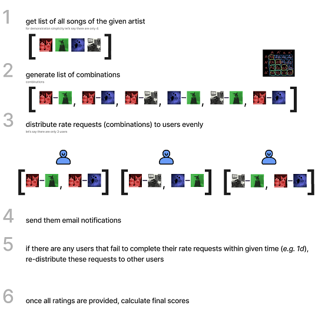

# App Description
**SoundCloudRater** is an application that allows you to group rate songs from a specific SoundCloud user, where the ranking is calculated using AHP. For now, the application is created for the needs of our group of friends, but if you want to rate with us, do not wait, register NOW!

[SoundCloudRater](soundcloudrater.web.app) - click this link to login or register!

**Important** - you will get songs to rate only if you were registered when the new rating was generated by the administrator!

## Rate

In this section, you have to choose between two songs, if you can't decide which one is better, choose a draw.

## Admin

This section is used for rating generation, which follows as illustrated below, and for uploading and deleting ratings, it is available to application administrators.

 

## Scores

 In this section you can search for ratings and view which ones have been created.
 
 # Tech Stack and Planned Features
 
 ## Stack
 
  * JavaScript
  * Node.js
  * Express.js
  * HTML
  * CSS
  * Firebase (Host, Auth, Firestore, Functions)
  * SoundCloud API
  * [SoundCloud Scraper](https://rapidapi.com/DataFanatic/api/soundcloud-scraper/)
 
 ## Planned features
 * Completion of functionality from points 4 and 5 from the description of "Generating rating".
 * Completion of the Final Scores generation functionality.
 * Rewriting it to TypeScript & React!
 * Distribution of songs by a given artist among users that should be described by them on [Genius](https://genius.com/).
 * Expanding the rating of songs so that they are assessed through the prism of several categories, and not as before, by choosing the one we like more.
